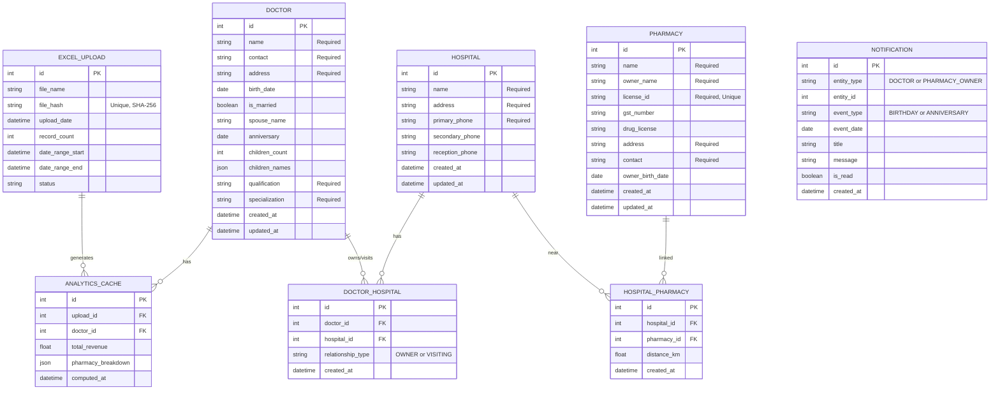
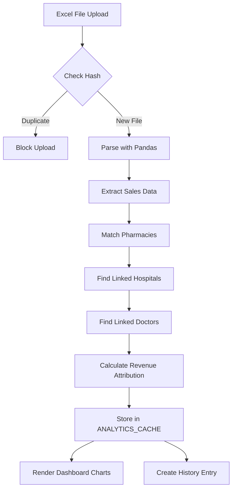

# SuratPharma Analytics - Database Entity Relationship Diagram

## Core Entities & Relationships



---

## Relationship Explanations

### Doctor ↔ Hospital (Many-to-Many)

- A doctor can work at multiple hospitals
- A hospital can have multiple doctors
- Relationship type: **OWNER** (owns the clinic) or **VISITING** (visits the hospital)

### Hospital ↔ Pharmacy (Many-to-Many)

- A hospital can have multiple nearby pharmacies
- A pharmacy can be near multiple hospitals
- Distance in kilometers stored for proximity reference

### Revenue Flow Chain

```
PHARMACY (sells products)
    ↓
HOSPITAL_PHARMACY (nearby linkage)
    ↓
HOSPITAL
    ↓
DOCTOR_HOSPITAL (doctor works here)
    ↓
DOCTOR (revenue attributed)
```

---

## Analytics Data Flow



---

## Sample Data Flow Example

**Scenario**: Dr. Amit Trivedi's revenue calculation

1. **Dr. Amit** owns **Happy Clinic** and visits **City Hospital**, **Sterling Hospital**
2. **Happy Clinic** is near pharmacies: **MedPlus**, **Apollo Pharmacy**
3. **City Hospital** is near: **HealthMart**, **1mg Store**
4. **Sterling Hospital** is near: **CureWell Pharmacy**

**When Excel shows sales from MedPlus**:

- MedPlus → Happy Clinic → Dr. Amit
- Revenue attributed to Dr. Amit from MedPlus

**Total Revenue Report**:

```
Dr. Amit Trivedi: ₹30,00,000
├── MedPlus:        ₹12,00,000 (40%)
├── Apollo:         ₹8,00,000  (27%)
├── HealthMart:     ₹5,00,000  (17%)
├── 1mg Store:      ₹3,00,000  (10%)
└── CureWell:       ₹2,00,000  (6%)
```

---

## Key Constraints

| Table               | Constraint                                                     | Purpose                            |
| ------------------- | -------------------------------------------------------------- | ---------------------------------- |
| `doctors`           | name, contact, address, qualification, specialization NOT NULL | Ensure core data present           |
| `pharmacies`        | license_id UNIQUE                                              | Prevent duplicate pharmacy entries |
| `excel_uploads`     | file_hash UNIQUE                                               | Prevent duplicate file processing  |
| `doctor_hospital`   | (doctor_id, hospital_id) UNIQUE                                | One link per pair                  |
| `hospital_pharmacy` | (hospital_id, pharmacy_id) UNIQUE                              | One link per pair                  |

---

## Indexes for Performance

```sql
-- Fast lookups
CREATE INDEX idx_doctor_name ON doctors(name);
CREATE INDEX idx_hospital_name ON hospitals(name);
CREATE INDEX idx_pharmacy_name ON pharmacies(name);
CREATE INDEX idx_pharmacy_license ON pharmacies(license_id);

-- Relationship queries
CREATE INDEX idx_dh_doctor ON doctor_hospital(doctor_id);
CREATE INDEX idx_dh_hospital ON doctor_hospital(hospital_id);
CREATE INDEX idx_hp_hospital ON hospital_pharmacy(hospital_id);
CREATE INDEX idx_hp_pharmacy ON hospital_pharmacy(pharmacy_id);

-- Analytics queries
CREATE INDEX idx_analytics_upload ON analytics_cache(upload_id);
CREATE INDEX idx_analytics_doctor ON analytics_cache(doctor_id);

-- Notification scheduling
CREATE INDEX idx_notification_date ON notifications(event_date);
CREATE INDEX idx_notification_read ON notifications(is_read);
```

---

_Database Design Document for SuratPharma Analytics_
